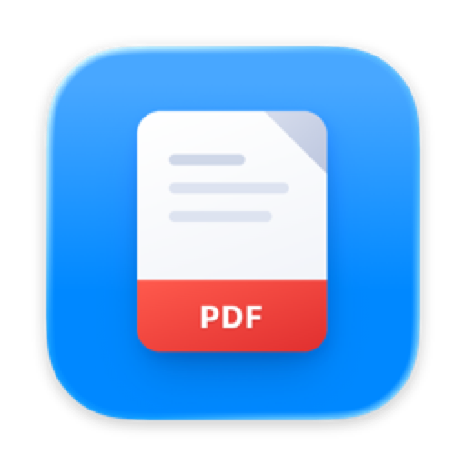

<div align="center">



# Toolbox

**The PDF utilities your Mac is missing.**

Shrink huge PDFs. Make scans searchable. All on your Mac — nothing ever leaves it.
**Free forever. No subscriptions, no fees, no catch.**


</div>

---

## Why Toolbox?

Every "free PDF compressor" on the web wants you to **upload your documents to someone else's server** — your contracts, your medical records, your bank statements. The rest want a subscription for what your Mac can do by itself.

Toolbox is different:

- 🔒 **Private by design.** Everything runs on your Mac. The app makes no network connections — your documents are never uploaded, analysed, or seen by anyone but you.
- 🆓 **Free forever.** No subscriptions, no fees, no "pro" tier, nothing to pay — ever. No account, no watermark, no page limit. Open source, so it stays that way.
- 🍎 **A real Mac app.** Native, fast, built for Apple Silicon. Drag files in, press one button.
- 🛡️ **Your originals are sacred.** Toolbox never touches the source file. Results are saved alongside as new files.

## What it does

### 🗜️ Compress — make PDFs dramatically smaller

Drop in your PDFs, pick a preset, done.

- **See before you squeeze** — Toolbox predicts each file's new size *before* you run anything.
- **Three presets** — *Smallest*, *Balanced* (recommended), or *High quality*.
- **Smart about scans** — black-and-white scans get a dedicated pipeline that can shrink them dramatically while keeping text razor-sharp.
- **Never worse off** — if a file can't be made smaller, it's left alone and reported as already optimised. You never get a bigger or broken file.

### 🔍 OCR — make scanned PDFs searchable

That 300-page scan you can't search? One click fixes it.

- Adds an **invisible text layer** using Apple's on-device text recognition — pages look pixel-identical, but now you can select, copy, and ⌘F the text.
- **Skips pages that already have text**, so re-running is always safe.
- Works entirely offline, like everything else in Toolbox.

### ⚡ Built for batches

Queue up as many files as you like, watch live progress, cancel any time. Results land next to your originals (`report.pdf` → `report-compressed.pdf`) or in any folder you choose.

## Install

**One line** — downloads the latest release, installs it into Applications, and launches it ([read the script](scripts/install.sh) first if you like):

```sh
curl -fsSL https://raw.githubusercontent.com/rossetv/toolbox/main/scripts/install.sh | bash
```

**Or by hand:**

1. **[Download the latest DMG →](../../releases)**
2. Open it and drag **Toolbox** into **Applications**.
3. First launch: macOS will warn that the app isn't notarised yet. **Right-click → Open**, or:

   ```sh
   xattr -dr com.apple.quarantine /Applications/Toolbox.app
   ```

Requires **macOS 14 or later** on **Apple Silicon**.

## Using it

1. Pick **Compress** or **OCR** in the sidebar.
2. Drag PDFs in, or click **Choose Files**.
3. Press the button. That's it.

## Good to know

- Compression is tuned per document — born-digital text stays sharp; scans get scan-specific treatment.
- Colour scans compress well, but the very best technique for them (MRC) isn't implemented yet.
- OCR recognises non-Latin scripts but doesn't yet embed them.

## Build from source

Requires Xcode and [XcodeGen](https://github.com/yonaskolb/XcodeGen).

```sh
scripts/build-ghostscript.sh   # build the bundled Ghostscript
xcodegen generate
xcodebuild -project Toolbox.xcodeproj -scheme Toolbox -configuration Debug test
scripts/package-dmg.sh         # → dist/Toolbox.dmg
```

## Licence

[AGPL-3.0-or-later](LICENSE). Bundles [Ghostscript](https://www.ghostscript.com/) under the same licence.

Copyright © 2026 Vilmar Rosset (toolbox@rosset.ie)

<div align="center">

**Your PDFs. Your Mac. Nobody else's business.**

</div>
